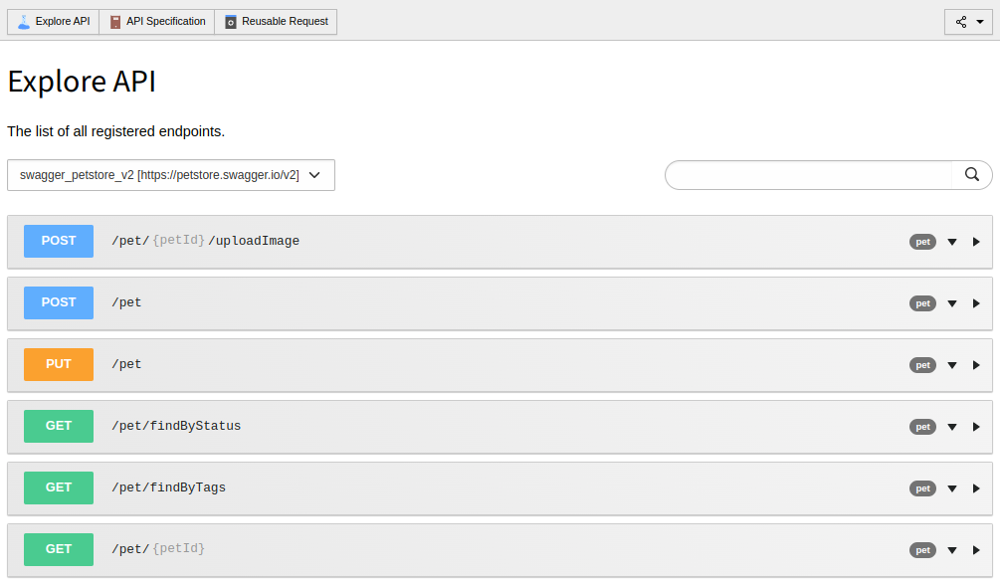
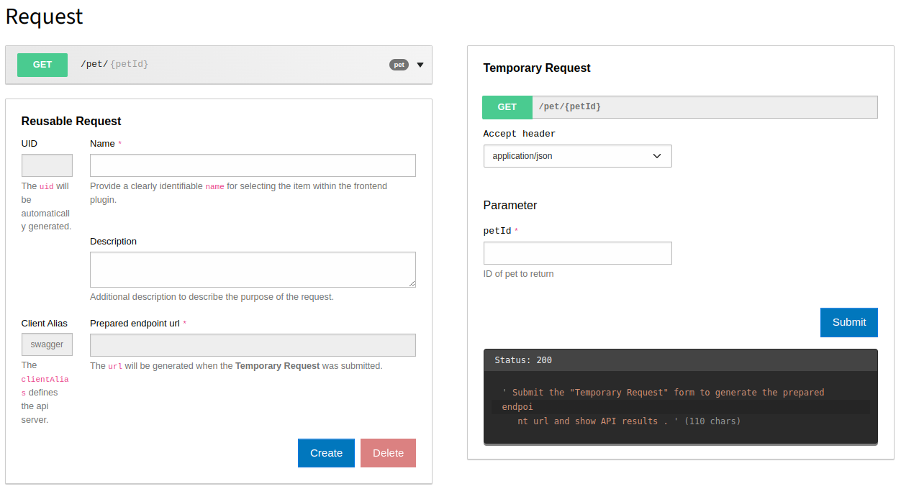
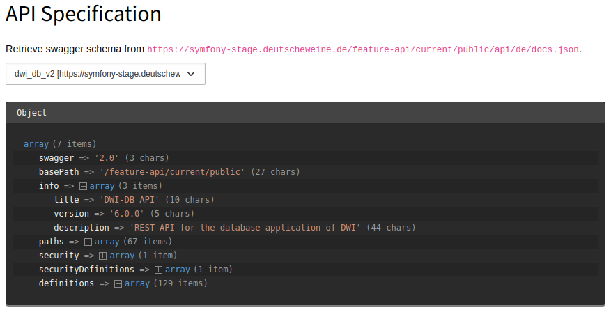
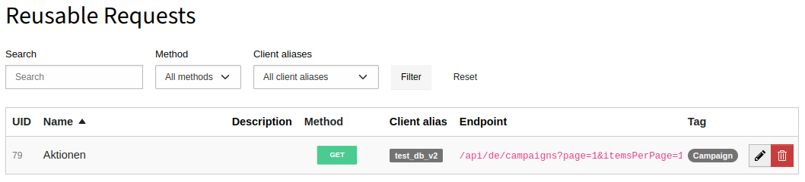

TYPO3 extension "xima_api_client"
=================================

This extension provides a generic client for swagger-based APIs. You can either use it as a php service in your code or
use the provided plugin to render responses of storable reusable api requests.

Features:

- backend module for exploring and querying configured APIs
- manage specific API calls in reusable request
- render the response data of reusable requests via a generic plugin to registered fluid templates
- provide list and details pages (including generic functionality like pagination)
- caching for all api responses
- further debugging options
- typo3 command `vendor/bin/typo3 api_client:query` for querying the API for debug purposes or displaying an API reference

# Concept

The "API Client" provided in this extension can be understood in 2 different ways:

1. The php service `Xima\XimaApiClient\ApiClient\ApiClient` offering various methods for querying the API like `request()`, `get()` or `post()`.
2. The backend module "API Client" enabling...
   1. ... the querying of the API in a visual way
   2. ... the creation of reusable requests which can then be used as a base for the generic plugin "Reusable Request" to render the response data to a fluid template.

# Installation

In a composer-based TYPO3 installation you can install the extension EXT:xima_api_client via composer:

``` bash
composer require xima/xima-api-client
```

# Usage

1. Install the extension.
2. Setup the api client configuration (e.g. hostname, api key, schema url, ...) in `additional.php` (see [Configuration](#configuration)).
3. Now you can use the api client as a php service (see [Query an API](#query-an-api)). If you like to render an api response via a fluid template (e.g. to render an entity list or a details page) proceed to the sections [Reusable Requests](#reusable-requests) and [Reusable Request Plugin](#reusable-request-plugin).

# Configuration

You can do all the necessary settings in the `additional.php` of your TYPO3 instance. An example configuration is shown below:

``` php
$GLOBALS['TYPO3_CONF_VARS']['EXTCONF'][\Xima\XimaApiClient\Configuration::EXT_KEY] = [
    'clients' => [
        'my_client_alias' => [
            'host' => 'https://example.org',
            'schemaUrl' => 'https://example.org/api/de/docs.json',
            'headers' => [
                'X-AUTH-TOKEN' => 'api_key'
            ],
        ]
    ]
];
```

# Backend Module

## Explore API

After having configured your APIs as described in [Configuration](#configuration) you can select these. You should then see the existing endpoints:



A click on any of the endpoints leads you to a split form offering 2 ways of accessing your API:

1. On the right: a temporary request to the API in order to test or debug it and see the response.
2. On the left: a form for storing a temporary request to a reusable one in order to apply it to a "reusable request" plugin.



## API Specification

This section offers the API's schema in a browsable way which might be useful in debug situations.



## Reusable Requests

After having stored a temporary request to a reusable one you can manage these in a list view in the backend:



You can then *reuse* them in the frontend plugin described next.

# Reusable Request Plugin

This plugin enables you to render arbitrary responses of the API to the frontend using an also arbitrary fluid template.

Simply select a reusable request in the plugin and configure it to your needs:


## Create a typical list/detail situation plugin setup

1. Create a reusable request for the list endpoint (e.g. /api/houses).
2. Create a reusable request for the item endpoint (e.g. /api/houses/{id}). Set the id to 0 since it's typically a mandatory field and you need to type in anything.
3. Create 2 pages as normally, one acting as the list page one as the one providing the details of each item.
4. Place a reusable request plugin in the list page.
   1. Select the appropriate reusable request.
   2. Specify a `detailPid` page pointing to the detail page.
   3. In the assigned fluid template add the following code to generate the links to the detail pages (note the prefix `xac_` which *needs* to be added to every overridable parameter to take effect!):

```fluid
<f:for each="{data.items}" as="item">
    <h1>{item.name}</h1>

    <f:link.action pluginName="ReusableRequest" controller="Request" pageUid="{data.tx_ximaapiclient_detail_pid}" arguments="{xac_id: item.id}">
        More
    </f:link.action>
</f:for>
```

5. Place a reusable request plugin in the detail page.
   1. Select the appropriate reusable request.
   2. Activate id as an overridable parameter so that it can be overridden by a GET parameter as added in the `f:link.action` view helper in the list template above.

## Add a pagination

1. Add a reusable request plugin as you would normally (see above).
2. Activate the pagination in the plugin's configuration.
3. Specify the endpoint's page parameter to be used.
4. Activate the overriding for the page parameter so that the pagination can take effect.
5. Add the following code to your fluid template:

```fluid
<f:if condition="{data.tx_ximaapiclient_pagination_active}">
    <f:render partial="Pagination" arguments="{pagination: pagination.pagination, paginator: pagination.paginator, paginationLinkArguments: pagination.paginationLinkArguments}" />
</f:if>
```

# Developer information

## Debug mode

The extension config contains a `debugMode`. Set it to 1 in order to have more debug information in the api client responses and a more verbose logging (e.g. exception stacktraces, the raw response in error case, ...).

## Query an API

Inject the `ApiClient` service as usual.

Before you can use one of the following methods, you need to init the  http client with the alias of your api client config (see [Configuration](#configuration)):

``` php
$this->apiClient->init('my_alias', true);
```

You can then use the `request()` method of  the ApiClient service...

``` php
$this->apiClient->request('/api/example', 'get', $data, $options, $jsonDecode);
```

... or the `get()` shorthand:

``` php
$this->apiClient->get('/api/example', $options, $jsonDecode);
```

... or the `post()` shorthand:

``` php
$this->apiClient->post('/api/example', $data, $options, $jsonDecode);
```

In addition, the ApiClient service comes with a magic `__call()`-method offering convenient  functions for getting your APIs data.

For example one could call the following method to the event item referenced by the ID 123 in the language German...

``` php
$this->apiClient->getEventItem('de', 123)
```

... or use the following method to get all events at once:

``` php
$this->apiClient->getEventCollection('de')
```

*Attention*

This functionality comes out of the box with zero configuration. The
only thing needed is the unique
[operationId](https://swagger.io/docs/specification/paths-and-operations/)
being set for the paths you'd like to use a convenient method for.

*Tip*

If some kind of error occurs while using `request()`, its shorthands or `\\call()`, you can check the `xima_api_client.log` log file. If you like
to get the errors programmatically (e.g. in order to print the errors to screen), you can use `$this->apiClient->getLastLogs()`.

## Caching

When accessing your APIs, performance is a crucial topic to deal with. Hence, the extension has built-in caching support for all requests done.
You can specify how long your request's responses should get cached in the edit form of each reusable request. Therefor TYPO3's built-in database
caching API is used (db table `cache_api_client_db_cache`).

**CAUTION**: The parameters of your requests are also taken into account. In detail this means, that the cache entry's *tag* is `request-<uid>` where
`uid` is the uid of the concrete request. The cache entry's *identifier* on the other hand is `request-<uid>-<url hash>` where `url hash` is a `sha1` hash
of the request's endpoint URL prepared with the parameters specified in your request. In consequence, especially for endpoints containing some kind
of ID, you might have multiple cache entries, e.g. one for `/my/endpoint/1` and one for `/my/endpoint/2`.

Of course, only requests with the HTTP method `GET` are cached.

In the API Client backend module you can at any time flush or warm up the caches. You can also use the CLI commands (see below) `api_client:cache:flush`
and `api_client:cache:warmup` to do so (in your deployment process for example).

### Clear Page Cache

This extension adds additional request cache clearing to the "clear page cache" action in the context of a particular page.

Therefor `RequestController::clearPageAndRequestCacheAction()` overrides the core functionality (see `ClearPageCacheController::mainAction()`) but calls it in
an update-safe way before doing its own handling.

## Events

You can use the following events in order to adjust the functionality to your needs:

| Event                      | Parameters               | Description                                                  |
|----------------------------|--------------------------|--------------------------------------------------------------|
| `ModifyResponseEvent`       | `$response`               | Modify the api client's response                             |
| `ModifySchemaEvent`         | `$schema`                 | Modify the api schema                                        |
| `ModifyRequestFiltersEvent` | `$reusableRequest, $page` | Modify the request's parameters before being sent to the api |

# CLI commands

The following commands are available to developers:

| Command                                   | Description                                   |
|-------------------------------------------|-----------------------------------------------|
| `vendor/bin/typo3 api_client:query`        | Query a configured API for debugging purposes |
| `vendor/bin/typo3 api_client:cache:flush`  | Flush several or all request caches at once   |
| `vendor/bin/typo3 api_client:cache:warmup` | Warmup several or all request caches at once  |

# Known limitations

Currently...

- ... only swagger 2.0 is supported.
- ... only GET requests are supported.
- ... only json data (production and consumption) is supported.
